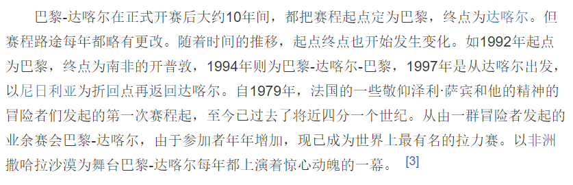

# questionnaireAnswer

## 2020年11月"法国体育"问卷的答案

### **1. 环法自行车赛创办于哪一年？**

#### <u>==1903==</u>

### **2. 法网多久举办一次？**

#### [一年一次]()

### **3. 以下哪些是法国足球运动员**

- [x] ==齐达内==
- [x] ==博格巴==
- [ ] 内马尔 (巴西)
- [ ] 德佩 (荷兰)
- [ ] 阿森西奥 (西班牙)
- [x] ==吉鲁==

### 4. 请问以下哪个球队属于法国足球甲级联赛

- [x] ==摩纳哥==
- [ ] 泽尼特 (俄罗斯)
- [ ] 凯尔特人 (苏格兰)
- [ ] 马德里竞技 (西班牙)
- [x] ==雷恩==
- [ ] 热那亚 (意大利)
- [ ] 尤文图斯 (意大利)
- [x] ==巴黎圣日耳曼==

### **6. 以下哪些运动品牌创立在法国？**

- [x] ==迪卡侬==

- [x] ==le coq==

- [ ] Fila (意大利)

- [ ] 阿迪达斯 (意大利)

- [ ] 彪马 (德国)

  

### **7. 达喀尔拉力赛每年的线路都是一样的吗？**

### ==<u>不是一样的</u>==

