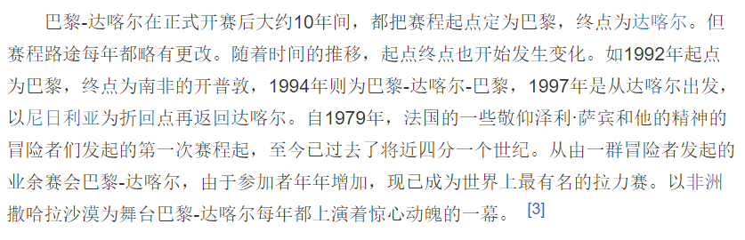

# questionnaireAnswer

## 2020年11月"法国体育"问卷的答案

### **1. 环法自行车赛创办于哪一年？**

#### [1903](https://baike.baidu.com/item/%E7%8E%AF%E6%B3%95%E8%87%AA%E8%A1%8C%E8%BD%A6%E8%B5%9B/3696325?fromtitle=%E7%8E%AF%E6%B3%95&fromid=9439955#1_1)

### **2. 法网多久举办一次？**

#### [一年一次](https://baike.baidu.com/item/%E6%B3%95%E5%9B%BD%E7%BD%91%E7%90%83%E5%85%AC%E5%BC%80%E8%B5%9B)

### **3. 以下哪些是法国足球运动员**

- [x] [齐达内](https://baike.baidu.com/item/%E9%BD%90%E5%86%85%E4%B8%81%C2%B7%E9%BD%90%E8%BE%BE%E5%86%85?fromtitle=%E9%BD%90%E8%BE%BE%E5%86%85&fromid=169291)
- [x] [博格巴](https://baike.baidu.com/item/%E4%BF%9D%E7%BD%97%C2%B7%E5%8D%9A%E6%A0%BC%E5%B7%B4?fromtitle=%E5%8D%9A%E6%A0%BC%E5%B7%B4&fromid=10294013)
- [ ] 内马尔 (巴西)
- [ ] 德佩 (荷兰)
- [ ] 阿森西奥 (西班牙)
- [x] [吉鲁](https://baike.baidu.com/item/%E5%A5%A5%E5%88%A9%E7%BB%B4%E5%B0%94%C2%B7%E5%90%89%E9%B2%81/185093?fromtitle=%E5%90%89%E9%B2%81&fromid=979945)

### 4. 请问以下哪个球队属于法国足球甲级联赛

- [x] [摩纳哥](https://baike.baidu.com/item/%E6%91%A9%E7%BA%B3%E5%93%A5%E8%B6%B3%E7%90%83%E4%BF%B1%E4%B9%90%E9%83%A8/5049955?fromtitle=%E6%91%A9%E7%BA%B3%E5%93%A5&fromid=20430164#viewPageContent)
- [ ] 泽尼特 (俄罗斯)
- [ ] 凯尔特人 (苏格兰)
- [ ] 马德里竞技 (西班牙)
- [x] [雷恩](https://baike.baidu.com/item/%E9%9B%B7%E6%81%A9%E8%B6%B3%E7%90%83%E4%BF%B1%E4%B9%90%E9%83%A8/8725531?fromtitle=%E9%9B%B7%E6%81%A9&fromid=7495236#viewPageContent)
- [ ] 热那亚 (意大利)
- [ ] 尤文图斯 (意大利)
- [x] [巴黎圣日耳曼](https://baike.baidu.com/item/%E5%B7%B4%E9%BB%8E%E5%9C%A3%E6%97%A5%E8%80%B3%E6%9B%BC%E8%B6%B3%E7%90%83%E4%BF%B1%E4%B9%90%E9%83%A8?fromtitle=%E5%B7%B4%E9%BB%8E%E5%9C%A3%E6%97%A5%E8%80%B3%E6%9B%BC&fromid=1345924)

### **6. 以下哪些运动品牌创立在法国？**

- [x] [迪卡侬](https://baike.baidu.com/item/%E8%BF%AA%E5%8D%A1%E4%BE%AC)

- [x] [le coq](https://baike.baidu.com/item/%E6%B3%95%E5%9B%BD%E5%85%AC%E9%B8%A1/6336832?fr=aladdin)

- [ ] Fila (意大利)

- [ ] 阿迪达斯 (德国)

- [ ] 彪马 (德国)

  

### **7. 达喀尔拉力赛每年的线路都是一样的吗？**

#### [不是一样的](https://baike.baidu.com/item/%E8%BE%BE%E5%96%80%E5%B0%94%E6%8B%89%E5%8A%9B%E8%B5%9B/605585?fr=aladdin#3)

